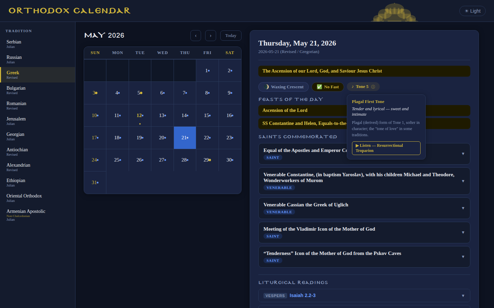
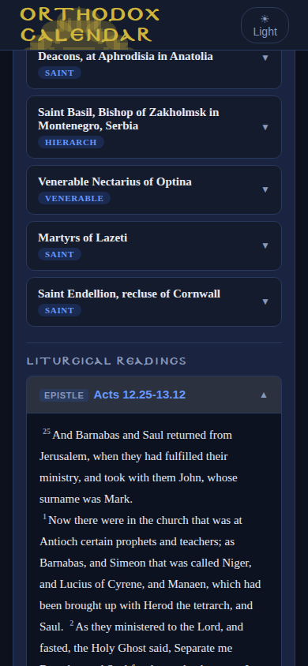

# Orthodox Calendar

Open-source liturgical calendar for all canonical Orthodox and Oriental Orthodox churches, with saints, hagiographies, fasting rules, and Epistle/Gospel readings for every day of the year.

[](https://ko-fi.com/nikolareljin)

## Screenshots

<table>
<tr>
<td width="70%" valign="top">

<br/><sub><b>Day detail view</b> — Greek tradition, Ascension of the Lord. Calendar grid (left) and day panel (right) showing feast banner, moon phase, fasting badge, Octoechos tone, saints list with canonization badges, and liturgical readings.</sub>
</td>
<td width="30%" valign="top">

<br/><sub><b>Mobile view</b> — saints list and expanded Epistle reading with full verse text.</sub>
</td>
</tr>
</table>

---

## History

This project began in **1993** as a program written in **Pascal**, running on **DOS**. Its original purpose was narrow: display the **Julian calendar saints' days of the Serbian Orthodox Church** on a single machine — a simple liturgical aid born from personal faith and a love of computing.

Over the following three decades it was rewritten, expanded, and adapted as the web matured. Hagiography texts were added. The calendar logic grew to accommodate every canonical Orthodox church — Greek, Russian, Romanian, Bulgarian, Antiochian, Alexandrian, Jerusalem, Ethiopian, and Oriental Orthodox — each with its own calendar system (Julian or Revised/Milankovich). Liturgical readings, iCal export, and a REST API followed.

What began as a Pascal/DOS screen is now a React front end backed by a FastAPI service with more than 2,970 saints across the full liturgical year. It is still a work in progress, and the Synaxarion of the whole Orthodox world is vast.

---

## Features

- **Monthly calendar grid** — navigate any month; Great Feast days are highlighted in gold, regular commemorations in blue.
- **Day detail** — click any day for saints, feast type, fasting rule, tone of the week, and full Epistle/Gospel readings.
- **Expandable hagiographies** — biography excerpts with links to full texts.
- **16 traditions** — Serbian, Russian, Greek, Romanian, Bulgarian, Antiochian, Alexandrian, Jerusalem, Georgian, Ethiopian, Oriental Orthodox (Coptic), Armenian Apostolic, Cyprus, Syriac, Malankara, Assyrian.
- **Full liturgical readings** — Epistle and Gospel verses inline with superscript verse numbers; expand each reading to see the full text.
- **Moon phase + fasting glyph** — lunar phase indicator and GOARCH-style fasting icon per day.
- **Canonization attribution** — each saint card shows which church canonized the saint and the scope (Universal / Pan-Orthodox / Local / Oriental).
- **Church directory** — history, patron, and official link for all 16 supported traditions.
- **Dual calendar** — Julian and Revised/New Calendar traditions handled transparently.
- **iCal feed** — subscribe to any tradition's feast calendar in Google Calendar, Apple Calendar, or Outlook.
- **Name-day checker** — paste a contact list; get back who celebrates today.
- **Dark / light themes** — dark theme follows the neobyzantine.org palette (navy, gold, royal blue); light theme uses Byzantine crimson on white. NB-Byzantine display typeface throughout.
- **REST API** — `GET /api/v1/saints`, `/api/v1/calendar`, `/api/v1/readings`, `/api/v1/moon-phase`, `/api/v1/movable-feasts`, `/api/v1/saints.ics` documented at `/api/v1/docs`.

---

## How to use

1. **Select a tradition** from the left sidebar. Each entry shows its calendar system (Julian or Revised).
2. **Navigate months** with ‹ › or click **Today**. Days with commemorations show a dot — gold for Great Feasts, blue for other saints.
3. **Click a day** to see all saints commemorated that day, the fasting rule, tone of the week, and liturgical readings.
4. **Expand a saint card** to read the hagiography excerpt and follow the link to the full biography.
5. **Subscribe via iCal** to add the tradition's feast calendar to any calendar application.

---

## Quickstart

### Docker (recommended)

```bash
git clone https://github.com/nikolareljin/orthodox-calendar.git
cd orthodox-calendar
cp .env.example .env   # review and adjust if needed
docker compose up --build
```

Frontend → `http://localhost`  
API docs → `http://localhost/api/v1/docs` (proxied through nginx)

The backend is never exposed directly to the host. All `/api/` traffic flows through the nginx reverse proxy on port 80. To override the port, set `PORT=8080` in `.env`.

### Local development

**Backend:**
```bash
cd backend
python -m venv .venv && source .venv/bin/activate
pip install -r requirements.txt
ORTHODOX_CALENDAR_DATA_PATH=app/data uvicorn app.main:app --reload
```

**Frontend:**
```bash
cd frontend
npm install
VITE_API_BASE=http://localhost:8000 npm run dev   # http://localhost:5173
```

---

## GitHub Pages deployment

The deploy workflow builds the frontend as a static site and publishes it to GitHub Pages on every merge of a `release/x.y.z` branch into `main`. Configure two things in your fork:

1. **Settings → Pages → Source:** GitHub Actions.
2. **Settings → Secrets → `VITE_API_BASE`:** public URL of your deployed backend (the backend cannot run on GitHub Pages itself — host it on Render, Railway, Fly.io, or any VPS).

---

## Support this project

This calendar has been maintained by volunteers since 1993. A public API and iCal feed carry real costs — hosting, bandwidth, and many hours of liturgical data curation. If this calendar is useful to you, your parish, or your community, please consider a donation.

| Platform | Link |
|---|---|
| Ko-fi | [](https://ko-fi.com/nikolareljin) |

Every contribution goes directly toward keeping the service free, expanding the data set, and improving the application for all Orthodox communities.

---

## Join the effort

If you maintain or have built an Orthodox calendar application — a mobile app, a parish website widget, a printed typikon generator, a liturgical data set in any language — we would like to hear from you.

We are looking for:

- **Data contributors** — Synaxarion entries, Octoechos tone schedules, movable-feast logic, translations into Greek, Russian, Serbian, Romanian, Arabic, Amharic, or any other liturgical language.
- **Calendar developers** — if your app already models Orthodox feast logic, let us compare notes, merge data sets, or federate APIs rather than duplicating work. Thirty years of reinventing this wheel is enough.
- **Hosting and infrastructure** — the backend needs a permanent public home so the iCal feeds and API can be a shared community resource.
- **Parishes and monasteries** — if you need a custom deployment, a printed format, or a tradition not yet covered, open an issue and describe what you need.

Open an issue or pull request at **https://github.com/nikolareljin/orthodox-calendar**, or start a discussion in the repository. All are welcome.

---

## Repository structure

```
orthodox-calendar/
├── backend/          FastAPI app — calendar logic, data loader, API routes
│   └── app/
│       ├── data/     JSON data files (saints per tradition)
│       └── services/ saints, name-days, iCal generation, readings proxy
├── frontend/         React SPA — calendar grid, day detail, themes
│   └── public/
│       └── fonts/    NB-Byzantine display typeface
├── .github/
│   └── workflows/    CI (gitleaks + scan + data-safety) and deploy (GitHub Pages)
├── CHANGELOG.md
└── docs/
    └── screenshots/
```

---

## Tooling

- `docker compose up --build` — full stack in Docker.
- `./build` — host install + build (uses script-helpers submodule).
- `./run` — backend + frontend dev servers with auto-cleanup on Ctrl+C.
- `./start [-b]` / `./stop` — Docker Compose shortcuts.

Full documentation: [`docs/`](docs/README.md) — architecture, API reference, frontend guide, and dev workflows.
